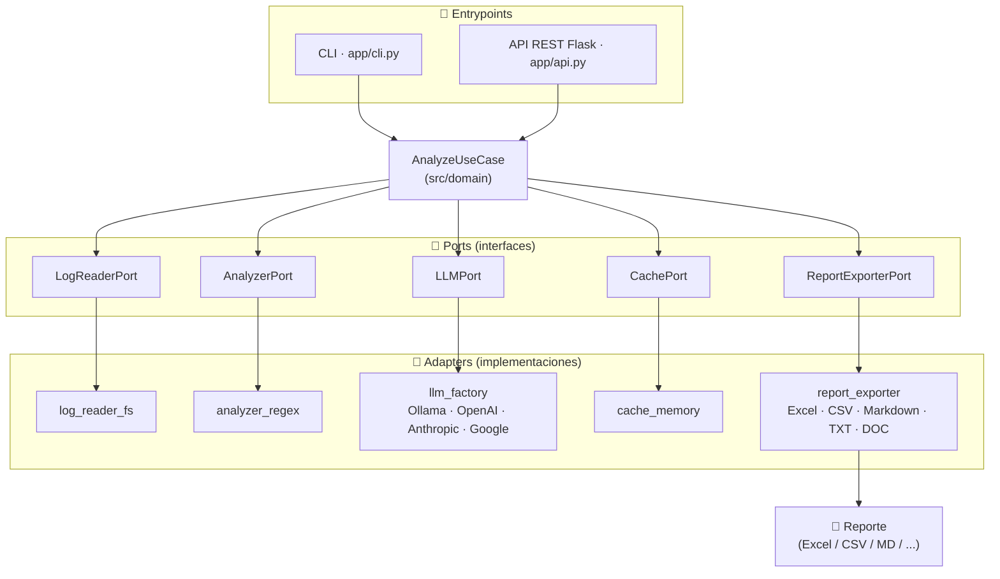

<!-- dynamic-badges -->
<p align="center">
  <a href="https://github.com/MaximilianoRodrigoSoria/log-analysis-agent/actions"></a>
  <a href="LICENSE"></a>
  
  <a href="https://maximilianorodrigosoria.github.io/log-analysis-agent/"></a>
  
</p>

# 📊 Log Analyzer


[](ARCHITECTURE.md)
[](docker-compose.yml)
[](https://www.python.org/)
[](https://flask.palletsprojects.com/)
[](https://ollama.ai/)
[](ARCHITECTURE.md)
[](LICENSE)
[](README.md)
[](CONTRIBUTING.md)

Sistema profesional de análisis de logs con generación automática de reportes usando
LLM local (Ollama) por defecto, con soporte para OpenAI, Anthropic y Google, cache
in-memory y salida en Excel.

Proyecto refactorizado con **arquitectura hexagonal (Ports & Adapters)** para máxima mantenibilidad y extensibilidad.

---

## 🏗️ Arquitectura

```
log_analyzer/
├── app/                    # Entrypoints (CLI y API)
│   ├── cli.py             # Interfaz de línea de comandos
│   └── api.py             # API REST con Flask
│
├── src/                   # Core del dominio
│   ├── domain/           # Lógica de negocio
│   │   ├── model.py      # Entidades y objetos de valor
│   │   └── use_cases.py  # Caso de uso: GenerateReportUseCase
│   │
│   ├── ports/            # Interfaces (ABC)
│   │   ├── llm_port.py
│   │   ├── cache_port.py
│   │   ├── log_reader_port.py
│   │   ├── analyzer_port.py
│   │   └── report_writer_port.py
│   │
│   ├── adapters/         # Implementaciones
│   │   ├── llm_factory.py
│   │   ├── llm_ollama.py
│   │   ├── llm_openai.py
│   │   ├── llm_anthropic.py
│   │   ├── llm_google.py
│   │   ├── cache_key.py
│   │   ├── cache_memory.py
│   │   ├── log_reader_fs.py
│   │   ├── analyzer_regex.py
│   │   ├── report_writer_excel.py
│   │   └── report_writer_fs.py
│   │
│   └── config/           # Configuración centralizada
│       ├── settings.py   # Variables de entorno
│       ├── constants.py  # Constantes del proyecto
│       └── logging_config.py
│
├── datasets/             # Logs de ejemplo
├── out/                  # Outputs (generados en runtime)
│   ├── reports/         # Reportes Excel/Markdown
│   └── analysis/        # Análisis JSON
│
├── requirements.txt
├── README.md
└── .gitignore
```

### Principios de Arquitectura

- **Hexagonal (Ports & Adapters)**: Dominio independiente de infraestructura
- **Dependency Inversion**: Domain no importa adapters
- **Single Responsibility**: Cada componente tiene una responsabilidad clara
- **Open/Closed**: Extensible sin modificar código existente (nuevos adapters)

---

## 🚀 Instalación

### Pre-requisitos

1. **Python 3.7+**
2. **Ollama** corriendo localmente (si usas `LLM_PROVIDER=ollama`)
3. **API keys** (opcional) para OpenAI, Anthropic o Google
   ```bash
   # Instalar Ollama: https://ollama.ai
   ollama pull mistral
   ollama serve
   ```

### Instalación del proyecto

```bash
# Clonar o navegar al proyecto
cd log_analyzer

# Crear entorno virtual (recomendado)
python -m venv venv

# Activar entorno virtual
# Windows:
venv\Scripts\activate
# Linux/Mac:
source venv/bin/activate

# Instalar dependencias
pip install -r requirements.txt
```

---

## 📖 Uso

### Opción 1: CLI (Línea de comandos)

```bash
# Uso básico
python app/cli.py --input datasets/generated_logs.txt

# Especificar directorio de salida
python app/cli.py --input datasets/generated_logs.txt --output ./custom_out

# Con run_id personalizado
python app/cli.py --input datasets/generated_logs.txt --run-id mi-analisis-001

# Con nivel de logging
python app/cli.py --input datasets/generated_logs.txt --log-level DEBUG
```

**Salida esperada:**
```
[INFO] Log Analyzer CLI
[INFO] Archivo de entrada: datasets\generated_logs.txt
[INFO] Directorio de salida: out
[INFO] Proveedor LLM: ollama (mistral)

[INFO] Iniciando análisis...
[INFO] [run_id=abc123] Iniciando generación de reporte
[INFO] [run_id=abc123] Leyendo logs desde archivo: datasets\generated_logs.txt
[INFO] [run_id=abc123] Analizando estructura del log
[INFO] [run_id=abc123] Análisis completado: 10 eventos, 6 errores, 2 warnings
[INFO] [run_id=abc123] Generando reporte con LLM
[INFO] [run_id=abc123] Reporte generado exitosamente: out\reports\abc123.xlsx

[OK] ✅ Análisis completado exitosamente!

Run ID: abc123
Reporte Excel: C:\lab\log_analyzer\out\reports\abc123.xlsx
Análisis JSON: C:\lab\log_analyzer\out\analysis\abc123.json

Resumen:
  - Total eventos: 10
  - Errores: 6
  - Warnings: 2
```

### Opción 2: API REST

```bash
# Iniciar servidor
python app/api.py
```

El servidor iniciará en `http://localhost:5000`

#### Endpoints disponibles:

**GET /** - Información de la API
```bash
curl http://localhost:5000/
```

**GET /health** - Health check
```bash
curl http://localhost:5000/health
```

**GET /datasets** - Lista de archivos de logs disponibles
```bash
curl http://localhost:5000/datasets
```

**Respuesta:**
```json
{
  "status": "success",
  "files": [
    {
      "name": "log1.txt",
      "size_bytes": 2048,
      "path": "/absolute/path/to/log1.txt"
    },
    {
      "name": "log2.txt",
      "size_bytes": 1024,
      "path": "/absolute/path/to/log2.txt"
    }
  ],
  "count": 2
}
```

**POST /reports/download** - Generar y descargar reporte en formato

```bash
# Descargar múltiples logs como CSV
curl -X POST http://localhost:5000/reports/download \
  -H "Content-Type: application/json" \
  -d '{
    "report_name": "analisis_mensual",
    "format": "csv",
    "files": ["log1.txt", "log2.txt"]
  }' \
  -o analisis_mensual.csv

# Formatos soportados: excel, txt, csv, doc
```

**Respuesta exitosa:**
```json
{
  "status": "success",
  "file_path": "/app/out/reports/abc123def456_report.csv",
  "size_bytes": 4096,
  "format": "csv",
  "name": "analisis_mensual"
}
```

**POST /analyze** - Analizar logs

```bash
# Ejemplo básico
curl -X POST http://localhost:5000/analyze \
  -H "Content-Type: application/json" \
  -d '{
    "log_text": "2026-02-13 08:30:15 ERROR [main] com.example.service.UserService - Error al procesar\njava.lang.NullPointerException: Cannot invoke method\n\tat com.example.service.UserService.process(UserService.java:45)"
  }'

# Con run_id personalizado
curl -X POST http://localhost:5000/analyze \
  -H "Content-Type: application/json" \
  -d '{
    "log_text": "...",
    "run_id": "custom-run-001"
  }'
```

**Respuesta exitosa:**
```json
{
  "status": "success",
  "run_id": "abc123def456",
  "report_paths": {
    "excel": "C:\\lab\\log_analyzer\\out\\reports\\abc123def456.xlsx"
  },
  "analysis_path": "C:\\lab\\log_analyzer\\out\\analysis\\abc123def456.json",
  "report_format": "excel",
  "summary": {
    "total_events": 10,
    "total_errors": 6,
    "total_warnings": 2
  }
}
```

---

## ⚙️ Configuración

### Variables de Entorno

Todas las configuraciones se pueden sobrescribir con variables de entorno:

| Variable | Default | Descripción |
|----------|---------|-------------|
| `LLM_PROVIDER` | `ollama` | Proveedor LLM (`ollama`, `openai`, `anthropic`, `google`) |
| `OLLAMA_BASE_URL` | `http://localhost:11434` | URL de Ollama |
| `OLLAMA_MODEL` | `mistral` | Modelo Ollama |
| `OPENAI_API_KEY` | `""` | API key de OpenAI |
| `OPENAI_MODEL` | `gpt-4o-mini` | Modelo OpenAI |
| `ANTHROPIC_API_KEY` | `""` | API key de Anthropic |
| `ANTHROPIC_MODEL` | `claude-sonnet-4-20250514` | Modelo Anthropic |
| `GOOGLE_API_KEY` | `""` | API key de Google |
| `GOOGLE_MODEL` | `gemini-1.5-flash` | Modelo Google |
| `CACHE_ENABLED` | `true` | Habilita cache in-memory |
| `CACHE_TTL_SECONDS` | `60` | TTL del cache en segundos |
| `REPORT_FORMAT` | `excel` | Formato de reporte (`excel`, `markdown`, `both`) |
| `OUT_DIR` | `./out` | Directorio de salida |
| `DATASETS_DIR` | `./datasets` | Directorio de datasets (logs disponibles) |
| `REPORT_DOWNLOAD_MAX_FILES` | `10` | Máximo de archivos para descargar reportes |
| `LOG_LEVEL` | `INFO` | Nivel de logging (DEBUG, INFO, WARN, ERROR) |
| `REQUEST_TIMEOUT_SECONDS` | `120` | Timeout para requests HTTP |

**Ejemplo:**
```bash
# Windows CMD
set LLM_PROVIDER=ollama
set OLLAMA_MODEL=llama2
set LOG_LEVEL=DEBUG
python app/cli.py --input datasets/generated_logs.txt

# Linux/Mac
export LLM_PROVIDER=ollama
export OLLAMA_MODEL=llama2
export LOG_LEVEL=DEBUG
python app/cli.py --input datasets/generated_logs.txt
```

---

## 📁 Outputs

El sistema genera dos tipos de archivos en `out/`:

### 1. Análisis JSON (`out/analysis/<run_id>.json`)

Análisis estructurado determinista del log:
```json
{
  "summary": {
    "total_events": 10,
    "total_errors": 6,
    "total_warnings": 2
  },
  "error_groups": [
    {
      "exception": "NullPointerException",
      "count": 2,
      "top_frame": {
        "where": "com.example.service.UserService.process",
        "file": "UserService.java",
        "line": 45
      },
      "logger": "com.example.service.UserService",
      "samples": [...],
      "first_ts": "2026-02-13 08:30:15",
      "last_ts": "2026-02-13 08:35:17"
    }
  ],
  "warnings": [...],
  "events": [...]
}
```

### 2. Reporte Excel (`out/reports/<run_id>.xlsx`)

Reporte tabular con formato profesional, generado por defecto.

### 3. Reporte Markdown (`out/reports/<run_id>.md`)

Reporte profesional generado por el LLM con:
- Resumen ejecutivo
- Análisis de patrones
- Detalle de grupos de errores
- Recomendaciones técnicas
- Conclusiones

---

## 🔒 Notas de Seguridad

### ⚠️ API Sin Autenticación

La API REST **NO tiene autenticación implementada**. Consideraciones:

- ✅ **OK para desarrollo local**
- ✅ **OK para redes internas protegidas**
- ❌ **NO exponer en internet sin autenticación**
- ❌ **NO usar en producción sin seguridad adicional**

**Para producción, considerar:**
- API Keys / Bearer tokens
- OAuth2 / JWT
- Rate limiting
- Firewall / VPN
- HTTPS obligatorio

### ⚠️ Prompt Injection

El sistema envía los logs directamente al LLM. Si los logs contienen contenido malicioso o instrucciones de prompt injection, podrían influir en la salida del reporte.

**Mitigaciones:**
- Validar/sanitizar logs antes de procesar
- Usar modelos locales (Ollama) para evitar fuga de datos
- Revisar outputs generados en entornos críticos

---

## 🎯 Ejemplos Avanzados

### Cambiar proveedor LLM (ej: OpenAI)
```bash
set LLM_PROVIDER=openai
set OPENAI_API_KEY=tu_api_key
python app/cli.py --input datasets/generated_logs.txt
```

### Conectar a Ollama remoto
```bash
set OLLAMA_BASE_URL=http://192.168.1.100:11434
python app/cli.py --input datasets/generated_logs.txt
```

### Cambiar formato de reporte
```bash
set REPORT_FORMAT=both
python app/cli.py --input datasets/generated_logs.txt
```

### Ajustar TTL del cache
```bash
set CACHE_TTL_SECONDS=120
python app/cli.py --input datasets/generated_logs.txt
```

### Aumentar timeout para logs grandes
```bash
set REQUEST_TIMEOUT_SECONDS=300
python app/cli.py --input large_logs.txt
```

### Logging detallado
```bash
python app/cli.py --input datasets/generated_logs.txt --log-level DEBUG
```

---

## 🔧 Extensibilidad

Gracias a la arquitectura hexagonal, puedes extender el sistema fácilmente:

### Agregar nuevo adapter de LLM

1. Crear un adapter en `src/adapters/` implementando `LLMPort`
2. Registrar el adapter en `src/adapters/llm_factory.py`
3. Usar `LLM_PROVIDER` para seleccionarlo sin tocar entrypoints

### Agregar lectura desde S3

1. Crear `src/adapters/log_reader_s3.py` implementando `LogReaderPort`
2. Usar en el entrypoint que corresponda

### Agregar analyzer con ML

1. Crear `src/adapters/analyzer_ml.py` implementando `AnalyzerPort`
2. Reemplazar `RegexLogAnalyzer()` por `MLAnalyzer()`

**El dominio no cambia, solo los adapters.**

---

## 📂 Política de .gitignore

El `.gitignore` incluye `out/` por defecto porque:

- ✅ Los reportes pueden contener información sensible
- ✅ Son archivos generados (no fuente)
- ✅ Cada ejecución genera nuevos archivos (ruido en git)

**Si quieres versionar reportes específicos:**
```bash
git add -f out/reports/importante.md
```

---

## 🐛 Troubleshooting

### Error: "No se puede conectar a Ollama"
```bash
# Verifica que Ollama esté corriendo
ollama serve

# Verifica el endpoint
curl http://localhost:11434/api/version
```

### Error: "Modelo no encontrado"
```bash
# Descarga el modelo
ollama pull mistral
```

### Error: "Timeout"
```bash
# Aumenta el timeout
set REQUEST_TIMEOUT_SECONDS=300
```

### Error: "No module named 'docx'"
El formato DOC requiere `python-docx` (ya incluido en requirements.txt):
```bash
pip install python-docx
```
**Nota:** Los formatos Excel, CSV, TXT y Markdown funcionan sin esta dependencia gracias a **lazy imports**.

### Error de encoding en Windows
Si ves `UnicodeEncodeError` en la consola, el servidor lo maneja automáticamente desde la versión actual.

### Logs con formato diferente
El analyzer usa regex específicos para logs tipo Java/Spring. Para otros formatos:
1. Crear un nuevo analyzer implementando `AnalyzerPort`
2. Reemplazar `RegexLogAnalyzer` en los entrypoints

---

## 🤝 Contribución

Para agregar nuevas funcionalidades:

1. **Ports**: Define la interfaz (ABC) en `src/ports/`
2. **Adapters**: Implementa la interfaz en `src/adapters/`
3. **Use Cases**: Actualiza lógica de negocio en `src/domain/use_cases.py`
4. **Entrypoints**: Compone dependencias en `app/cli.py` o `app/api.py`

---

## 📄 Licencia

Este proyecto es de código abierto para fines educativos y de laboratorio.

---

## 👨‍💻 Arquitectura Técnica - Resumen

- **Patrón**: Hexagonal (Ports & Adapters)
- **Lenguaje**: Python 3.7+
- **LLM**: Ollama (default), OpenAI, Anthropic, Google
- **Framework API**: Flask
- **Testing**: Arquitectura permite fácil testing con mocks de ports
- **Logging**: `logging` estándar con run_id tracking
- **Config**: Variables de entorno + defaults
- **Output**: JSON (análisis) + Excel/Markdown (reporte)

**Ventajas de esta arquitectura:**
- ✅ Dominio desacoplado de infraestructura
- ✅ Fácil testing (mock de ports)
- ✅ Extensible sin modificar dominio
- ✅ Mantenible a largo plazo
- ✅ Claro y documentado

---

## 📞 Contacto

**Maximiliano Rodrigo Soria**

- 📱 Teléfono: +54 9 11 2704-3256 (Argentina)
- 💼 GitHub: [MaximilianoRodrigoSoria](https://github.com/MaximilianoRodrigoSoria)

Para consultas, sugerencias o contribuciones al proyecto.

---

**Happy logging! 📊🚀**

---

<!-- diagrama-mermaid -->
## 📊 Diagrama de arquitectura


